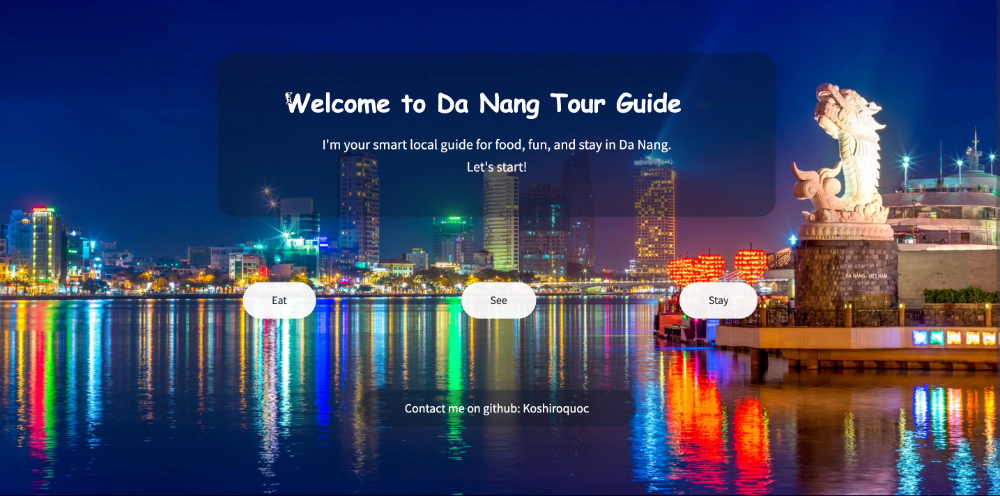

# Da Nang Tour Guide 🏖️

**Da Nang Tour Guide** is a smart local assistant that helps travelers discover the best places to eat, see and stay in Da Nang, Viet Nam. It combines traditional keyword search with vector similarity and a large language model to deliver detailed, locally relevant responses.

<p align="center">
  
</p>

## Problem Description
Travelers often struggle to find truly local recommendations. This project solves that problem by indexing a curated dataset of Da Nang restaurants, attractions and hotels into Elasticsearch. A hybrid retrieval pipeline then feeds the most relevant entries to Google's Gemma model so that users get trustworthy answers in natural language.

## Dataset
The main dataset is `Data/data_danang_ok.csv` (300 rows). Each record includes:

- `type` – category (`eat`, `see`, `stay`)
- `name` and `description`
- `time`, `price`, `location` and `area`
- additional `note` field

Vector representations are precomputed and stored in the same file. No external download is required, the CSV ships with the repository.

## Project Structure
```
localguide_assistant/
├── app_final_version.py    # Streamlit user interface
├── Hybridsearch.py         # Hybrid retrieval and RAG logic
├── Indexing.py             # Elasticsearch indexing script
└── Images/                 # UI assets

Data/
└── data_danang_ok.csv      # Tourism database

NoteBook/
├── Hybridsearch_test.ipynb # Development notebook
└── evaluation.ipynb        # Example analysis
Dockerfile                   # Container build file
entrypoint.sh                # Starts indexing and Streamlit
```

## Installation
### Prerequisites
- Python 3.12+
- Docker & Docker Compose
- Google AI API key

### Clone the Repository
```bash
git clone https://github.com/koshiroquoc/DaNangtourguide.git
cd DaNangtourguide
```

### Environment
Install Python dependencies locally or let Docker handle them:
```bash
pip install -r requirements.txt
```
Create a `.env` file containing your API key:
```bash
GOOGLE_API_KEY=your_google_ai_api_key_here
```

## Running the Project
### Using Docker Compose
The easiest way is to start everything through Docker Compose. This spins up Elasticsearch and the Streamlit app in one command:
```bash
docker-compose up --build
```
Visit `http://localhost:8501` and start chatting.

### Manual Execution
1. Launch Elasticsearch manually or with Docker.
2. Run the indexing script to load the dataset:
   ```bash
   python localguide_assistant/Indexing.py
   ```
3. Start the Streamlit interface:
   ```bash
   streamlit run localguide_assistant/app_final_version.py
   ```

## How It Works
1. **Indexing** – `Indexing.py` loads the CSV, creates dense vectors using SentenceTransformers and stores everything in Elasticsearch.
2. **Hybrid Search** – `Hybridsearch.py` performs both BM25 keyword search and vector search, merging the results with Reciprocal Rank Fusion.
3. **RAG Generation** – Retrieved documents are formatted into a prompt and sent to Google Gemma to generate the final answer.
4. **Interface** – `app_final_version.py` offers a simple menu-based interface built with Streamlit.

## Demo Video
<p align="center">
  <video src="localguide_assistant/Images/Video_Demo_Real.mp4" controls width="600"></video>
</p>

[](https://youtu.be/xLPV0583Ctw)
## Usage Tips
1. Choose a category (Eat, See or Stay).
2. Ask natural language questions such as:
   - "Where can I find good pho for breakfast?"
   - "Recommend budget hotels near the beach."
3. Receive detailed suggestions including price, location and special notes.

## Dependency Versions
All required packages with pinned versions are listed in `requirements.txt` and will be installed automatically when building the Docker image or running `pip install -r requirements.txt`.

## Contributing
Pull requests are welcome. Please test any changes with the provided notebooks before submitting.

## Contact
- GitHub: [@koshiroquoc](https://github.com/koshiroquoc)

---
*Built with ❤️ for travelers exploring the beautiful city of Da Nang*
