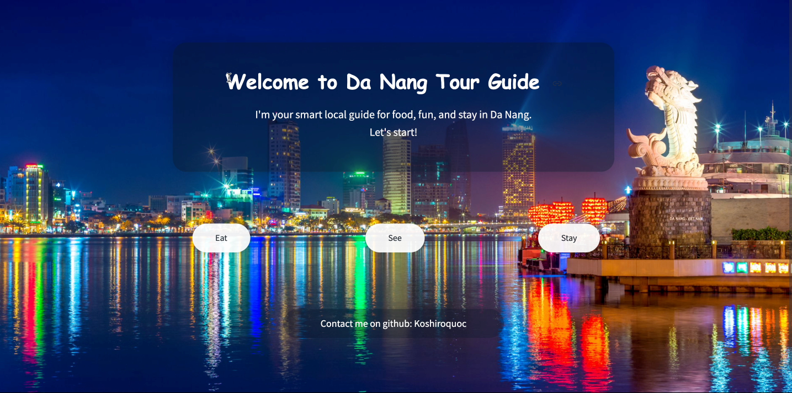

# Da Nang Tour Guide 🏖️

**Da Nang Tour Guide** is a smart local assistant that helps travelers discover the best places to eat, see, and stay in Da Nang, Vietnam. It combines traditional keyword search with vector similarity and a large language model to deliver detailed, locally relevant responses.

<p align="center">
  
</p>

## Problem Description
Travelers often struggle to find truly local recommendations. This project solves that problem by indexing a curated dataset of Da Nang restaurants, attractions, and hotels into Elasticsearch. A hybrid retrieval pipeline then feeds the most relevant entries to Google's Gemma model so that users get trustworthy answers in natural language.

## Dataset

The default dataset is now `Data/processed/places_enriched_v2.jsonl`: a
reproducible OpenStreetMap base plus a conservative Wikivoyage factual overlay.
Every record links to its upstream OSM element; every accepted enrichment field
also stores its own source revision, license, timestamps, and match score.

The original 299-row generated CSV remains unchanged as a legacy evaluation
baseline. It is no longer presented as verified local data. Missing OSM facts
such as prices and manually verified status remain null rather than being
generated. See `Data/README.md`, `docs/data_contract_v2.md`, and the generated
quality report in `docs/reports/data_quality_osm.md`.
The enrichment report and balanced 200-place manual verification queue are in
`docs/reports/enrichment_report.md` and
`Data/curation/verification_queue_v1.csv`.

## Project Structure
```
localguide_assistant/
├── app.py                  # Streamlit user interface and session state
├── config.py               # Environment-backed configuration
├── retrieval.py            # BM25, vector search, and RRF
├── generation.py           # Grounded prompt and Google GenAI adapter
├── service.py              # RAG orchestration and latency breakdown
├── indexer.py              # Batch embedding and bulk indexing command
├── logging_db.py           # SQLite feedback persistence
├── Hybridsearch.py         # Backward-compatible API wrapper
├── Indexing.py             # Backward-compatible command wrapper
└── Images/                 # UI assets

Data/
├── processed/              # OSM base and enriched default snapshots
├── enrichment/             # CC BY-SA factual overlay + attribution
├── curation/               # Balanced manual verification queue
├── README.md               # Sources, license, and refresh policy
└── data_danang_ok.csv      # Unchanged synthetic legacy baseline

data_pipeline/
├── build_dataset.py        # Reproducible Overpass snapshot command
├── build_enriched_dataset.py # Wikivoyage overlay + verification queue
├── enrichment.py           # Matching, TTL and fill-null-only rules
├── wikivoyage.py           # MediaWiki fetch and structured listing parser
├── osm.py                  # OSM query, normalization, and deduplication
├── schema.py               # Versioned place contract and validation
├── quality.py              # Quality gates and report generation
└── legacy.py               # Explicit legacy price parsing helper

NoteBook/
├── Hybridsearch_test.ipynb # Development notebook
└── evaluation.ipynb        # Example analysis
Dockerfile                   # Container build file
entrypoint.sh                # Starts indexing and Streamlit
```

## Installation
### Prerequisites
- Python 3.12+
- Docker & Docker Compose
- Google AI API key

### Clone the Repository
```bash
git clone https://github.com/koshiroquoc/DaNangtourguide.git
cd DaNangtourguide
```

### Environment
Install Python dependencies locally or let Docker handle them:
```bash
pip install -r requirements.txt
```
Copy `.env.example` to `.env` and add your API key:
```bash
cp .env.example .env
```

The `.env` file is excluded from both Git and the Docker build context.

## Running the Project
### Using Docker Compose
The easiest way is to start everything through Docker Compose. This spins up Elasticsearch and the Streamlit app in one command:
```bash
docker-compose up --build
```
Visit `http://localhost:8501` and start chatting.

### Manual Execution
1. Launch Elasticsearch manually or with Docker.
2. Run the indexing script to load the dataset:
   ```bash
   python -m localguide_assistant.indexer --skip-if-exists
   ```
3. Start the Streamlit interface:
   ```bash
   streamlit run localguide_assistant/app.py
   ```

## How It Works
1. **Indexing** – `indexer.py` batch-embeds atomic place records and bulk
   indexes them into Elasticsearch. Repeated starts skip only when the source
   row count and SHA-256 fingerprint both match.
2. **Hybrid Search** – `retrieval.py` runs BM25 and dense retrieval, then
   combines their ranks with Reciprocal Rank Fusion.
3. **RAG Generation** – Source-labelled records are sent through the supported
   Google GenAI SDK. The response includes answer text, sources, and a latency
   breakdown.
4. **Interface** – `app.py` keeps the answer in Streamlit session state, so a
   feedback click never regenerates or logs a different answer.

## Demo Video
<p align="center">
  <video src="localguide_assistant/Images/Video_Demo_Real.mp4" controls width="600"></video>
</p>

[](https://youtu.be/xLPV0583Ctw)
## Usage Tips
1. Choose a category (Eat, See, or Stay).
2. Ask natural language questions such as:
   - "Where can I find good pho for breakfast?"
   - "Recommend budget hotels near the beach."
3. Receive detailed suggestions including price, location, and special notes.

## Sample Questions
Try asking:
- "What are good vegetarian restaurants near My Khe Beach?"
- "Where to stay if I want a sea view under $30?"
- "What are the must-see attractions in Da Nang at night?"

## Dependency Versions
Runtime packages are pinned in `requirements.txt`; test dependencies are in
`requirements-dev.txt`. The application uses the supported `google-genai` SDK,
not the legacy `google-generativeai` package.

## Contributing
Pull requests are welcome. Please test any changes with the provided notebooks before submitting.

## Documentation
Each module is commented with docstrings following Google style. See source files in `localguide_assistant/` for details.

## Evaluation
The original notebook is retained as a **legacy baseline**: BM25 reached about
**0.88 recall@5**, vector search **0.57**, and RRF hybrid search **0.86**. The
existing questions are heavily biased toward venue-name lookup, so these
numbers must not be treated as product-quality discovery metrics. A
query-centric, multi-relevance evaluation set is the next project phase.

## Limitations
The OSM snapshot has broad coverage but sparse opening-hours, contact, and
price metadata. An OSM edit timestamp does not prove that a business still
operates, and this phase does not manually verify venues. Answers are generated
with **Google's Gemma model**, so occasional inaccuracies or biased content are
possible. The interface exposes source links so users can verify important
details.

## Contact
- GitHub: [@koshiroquoc](https://github.com/koshiroquoc)
- Instagram: [@koshiroquoc](https://www.instagram.com/koshiroquoc)

## Disclaimer
This chatbot uses generative AI to produce responses. While we aim for accuracy, the answers may be incorrect, outdated, or misleading. Users should verify any critical information independently.

---
*Built with ❤️ for travelers exploring the beautiful city of Da Nang*
